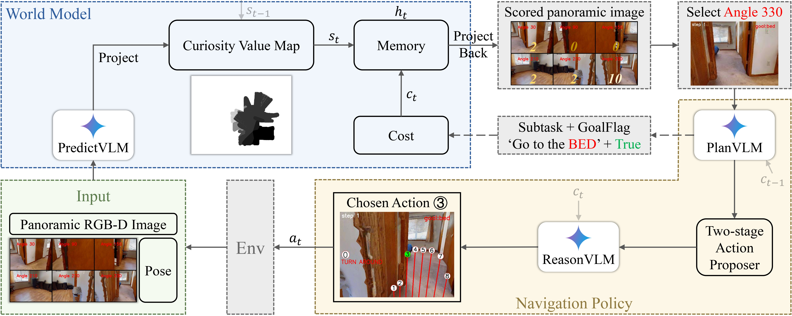

<h1 align="center">WMNav: Integrating Vision-Language Models into World Models for Object Goal Navigation</a>
</h1>

<h5 align="center">

[](https://arxiv.org/abs/2503.02247) 
[](https://b0b8k1ng.github.io/WMNav/)  [](https://www.youtube.com/watch?v=RnHtHueHGtg)
</h5>

<div align="center">
Dujun Nie<sup>1,*</sup>, Xianda Guo<sup>2,*</sup>, Yiqun Duan<sup>3</sup>, Ruijun Zhang<sup>1</sup>, Long Chen<sup>1,4,5,†</sup>

<sup>1</sup> Institute of Automation, Chinese Academy of Sciences, <sup>2</sup> School of Computer Science, Wuhan University, <sup>3</sup> School of Computer Science, University of Technology Sydney, <sup>4</sup> IAIR, Xi'an Jiaotong University, <sup>5</sup> Waytous
:email:: niedujun2024@ia.ac.cn, xianda_guo@163.com, duanyiquncc@gmail.com 
</div>

<div align="center">
This repository is the official implementation of WMNav, a novel World Model-based Object Goal Navigation framework powered by Vision-Language Models.
</div>
<p align="center">
  
  <p align="center">Overview of our navigation framework</p>  
</p>

## 🔥 News
* **` Mar. 14th, 2025`:** The code of WMNav is available! ☕️
* **` Mar. 4th, 2025`:** We released our paper on [Arxiv](https://arxiv.org/abs/2503.02247).

## 📚 Table of Contents
- [Get Started](#-get-started)
  - [Installation and Setup](#-installation-and-setup)
  - [Prepare Dataset](#-prepare-dataset)
  - [API Key](#-api-key)
- [Demo](#-demo)
- [Evaluation](#-evaluation)
- [Customize Experiments](#-customize-experiments)
- [Acknowledgement](#-acknowledgement)
- [Citation](#-citation)
- [Contact](#-contact)

## 🚀 Get Started

### ⚙️ Installation and Setup
1. clone this repo.
    ```
    git clone https://github.com/B0B8K1ng/WMNavigation
    cd WMNav
    ```
2. Create the conda environment and install all dependencies.
    ```
    conda create -n wmnav python=3.9 cmake=3.14.0
    conda activate wmnav
    conda install habitat-sim=0.3.1 withbullet headless -c conda-forge -c aihabitat
    
    pip install -e .
    
    pip install -r requirements.txt
    ```
   
### 🛢️ Prepare Dataset
This project is based on [Habitat simulator](https://aihabitat.org/) and the HM3D and MP3D datasets are available [here](https://github.com/facebookresearch/habitat-sim/blob/main/DATASETS.md).
Our code requires all above data to be in a data folder in the following format. Move the downloaded HM3D v0.1, HM3D v0.2 and MP3D folders into the following configuration:

```
├── <DATASET_ROOT>
│  ├── hm3d_v0.1/
│  │  ├── val/
│  │  │  ├── 00800-TEEsavR23oF/
│  │  │  │  ├── TEEsavR23oF.navmesh
│  │  │  │  ├── TEEsavR23oF.glb
│  │  ├── hm3d_annotated_basis.scene_dataset_config.json
│  ├── objectnav_hm3d_v0.1/
│  │  ├── val/
│  │  │  ├── content/
│  │  │  │  ├──4ok3usBNeis.json.gz
│  │  │  ├── val.json.gz
│  ├── hm3d_v0.2/
│  │  ├── val/
│  │  │  ├── 00800-TEEsavR23oF/
│  │  │  │  ├── TEEsavR23oF.basis.navmesh
│  │  │  │  ├── TEEsavR23oF.basis.glb
│  │  ├── hm3d_annotated_basis.scene_dataset_config.json
│  ├── objectnav_hm3d_v0.2/
│  │  ├── val/
│  │  │  ├── content/
│  │  │  │  ├──4ok3usBNeis.json.gz
│  │  │  ├── val.json.gz
│  ├── mp3d/
│  │  ├── 17DRP5sb8fy/
│  │  │  ├── 17DRP5sb8fy.glb
│  │  │  ├── 17DRP5sb8fy.house
│  │  │  ├── 17DRP5sb8fy.navmesh
│  │  │  ├── 17DRP5sb8fy_semantic.ply
│  │  ├── mp3d_annotated_basis.scene_dataset_config.json
│  ├── objectnav_mp3d/
│  │  ├── val/
│  │  │  ├── content/
│  │  │  │  ├──2azQ1b91cZZ.json.gz
│  │  │  ├── val.json.gz
```
The variable DATASET_ROOT can be set in [.env file](.env).

### 🚩 API Key
To use the Gemini VLMs, paste a base url and api key into the [.env file](.env) for the variable called GEMINI_BASE_URL and GEMINI_API_KEY.
You can also try other VLMs by modifying [```api.py```](src/api.py)(using the OpenAI libraries)

##  🎮 Demo
Run the following command to visualize the result of an episode:
```
python scripts/main.py
```
In the logs/ directory, there should be saved gifs:
<p align="center">
  <br>
  
<p>

## 📊 Evaluation
To evaluate WMNav at scale (HM3D v0.1 contains 1000 episodes, 2000 episodes for HM3D v0.2 and 2195 episodes for MP3D), we use a framework for parallel evaluation. The file ```parallel.sh``` contains a script to distribute K instances over N GPUs, and for each of them to run M episodes. Note each episode consumes ~320MB of GPU memory. A local flask server is intialized to handle the data aggregation, and then the aggregated results are logged to wandb. Make sure you are logged in with `wandb login`

This implementation requires `tmux` to be installed. Please install it via your package manager:

- Ubuntu/Debian: `sudo apt install tmux`
- macOS (with Homebrew): `brew install tmux`

```
# parallel.sh
ROOT_DIR=PROJECT_DIR
CONDA_PATH="<user>/miniconda3/etc/profile.d/conda.sh"
NUM_GPU=5
INSTANCES=50
NUM_EPISODES_PER_INSTANCE=20  # 20 for HM3D v0.2, 40 for HM3D v0.1, 44 for MP3D 
MAX_STEPS_PER_EPISODE=40
TASK="ObjectNav"
DATASET="hm3d_v0.2"  # Dataset [hm3d_v0.1, hm3d v0.2, mp3d]
CFG="WMNav"  # Name of config file
NAME="Evaluation"
PROJECT_NAME="WMNav"
VENV_NAME="wmnav" # Name of the conda environment
GPU_LIST=(3 4 5 6 7) # List of GPU IDs to use
```
results are saved in logs/ directory.

## 🔨️ Customize Experiments
To run your own configuration, please refer to the [YAML file](config/WMNav.yaml) detailing the configuration variables:
```yaml
task: ObjectNav
agent_cls: WMNavAgent # agent class
env_cls: WMNavEnv # env class

agent_cfg:
  navigability_mode: 'depth_sensor' 
  context_history: 0
  explore_bias: 4 
  max_action_dist: 1.7
  min_action_dist: 0.5
  clip_frac: 0.66 # clip action distance to avoid getting too close to obstacles
  stopping_action_dist: 1.5 # length of actions after the agent calls stop
  default_action: 0.2 # how far forward to move if the VLM's chosen action is invalid
```
💡 If you want to the design your own model(achieved by designing our own CustomAgent and CustomEnv) or try ablation experiments detailed in the paper, please refer to the [```cumstom_agent.py```](src/custom_agent.py) and [```custom_env.py```](src/custom_env.py).

## 🙇 Acknowledgement

This work is built on many amazing research works and open-source projects, thanks a lot to all the authors for sharing!

- [VLMnav](https://github.com/Jirl-upenn/VLMnav)
- [Pixel-Navigator](https://github.com/wzcai99/Pixel-Navigator/tree/master)
- [habitat-lab](https://github.com/facebookresearch/habitat-lab)
- [habitat-sim](https://github.com/facebookresearch/habitat-sim)
- [Matterport3D](https://github.com/niessner/Matterport)
- 
## 📝 Citation
If you find our work useful in your research, please consider giving a star :star: and citing the following paper :pencil:.

```bibTeX
@article{nie2025wmnav,
  title={WMNav: Integrating Vision-Language Models into World Models for Object Goal Navigation},
  author={Nie, Dujun and Guo, Xianda and Duan, Yiqun and Zhang, Ruijun and Chen, Long},
  journal={arXiv preprint arXiv:2503.02247},
  year={2025}
}
```

## 🤗 Contact

For feedback, questions, or press inquiries please contact niedujun2024@ia.ac.cn.